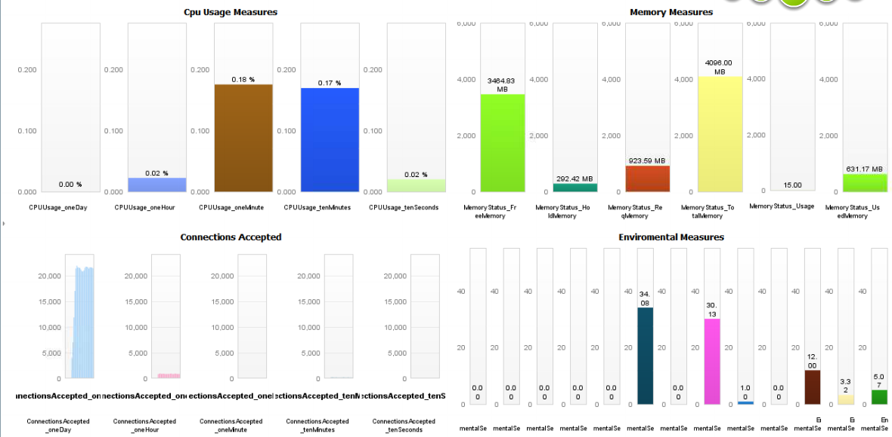

# WebSphere DataPower Monitor Plugin

## Overview

This plugin enables monitoring of the WebSphere Data Power SOA Appliance. The plugin uses the XML Management interface as described in this PDF:
[SOMA_redp4446.pdf](SOMA_redp4446.pdf)

## Plugin Details

| Name | WebSphere DataPower Monitor Plugin
| :--- | :---
| Author | Noormohammed Sheikh (noor.sheikh@compuware.com)  
| | Chuck Miller (charles.miller@compuware.com)  
| | Jeffrey Fynboh (jeffrey.fynboh@compuware.com)
| Supported dynaTrace Versions | >= 5.5
| License | [dynaTrace BSD](dynaTraceBSD.txt)
| Support | [Not Supported](https://community.compuwareapm.com/community/display/DL/Support+Levels)
| Release History | 2012-06-25 1.0.1 Initial Release
| Download | [WebSphere DataPower Monitor Plugin for dynaTrace](dynatrace.diagnostics.plugin.DataPowerMonitor.jar)  
| | [Data Power Monitor Dashboard ](DataPowerDevice.dashboard.xml)

## Dashboards

The following image shows the attached dashboard including all metrics that the monitor provides:

## Installation

Import the Plugin into the dynaTrace Server via the dynaTrace Server Settings menu -> Plugins -> Install Plugin. For details how to do this please refer to the [dynaTrace
documentation](https://community.dynatrace.com/community/display/DOCDT41/Manage+and+Develop+Plugins#ManageandDevelopPlugins-ManageandDevelopPlugins).

## Configuration

|Name | Type | Value
| :-- | :--- | :---
| Protocol | list | https
| Port | long | 5550
| Soma Path | string | /service/mgmt/current
| SOMA SOAP Envelope Template | string | <?xml version="1.0" encoding="UTF-8"?><env:Envelope xmlns:env="http://schemas.xmlsoap.org/soap/envelope/"><env:Body><dp:request domain="default" xmlns:dp="http://www.datapower.com/schemas/management"><dp:get-status class="<at:var at:name="SOMAMONITORCLASS" />"/></dp:request></env:Body></env:Envelope>
| HTTP Version | list | 1.1
| User-Agent | string | dynaTrace/4
| Max. redirects | long | 0
| Match Content list | Disabled 
|Server authorization | Boolean | Check Box Selected 
| Server Username | string | The username to access data power device
|Server Password |string|The password to access data power device
|Proxy |Boolean |Check Box Unselected
|Disable certificate Veralidation |boolean |Check Box Selected

